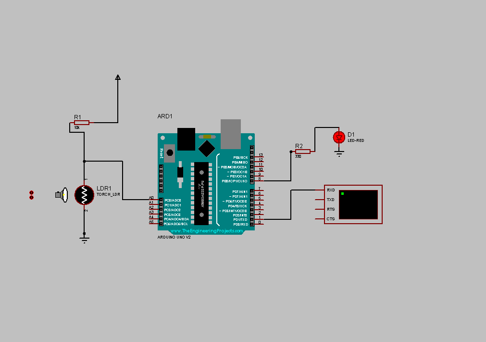
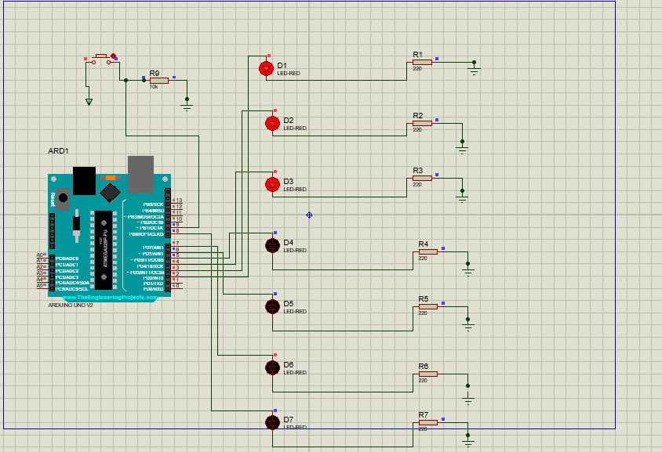
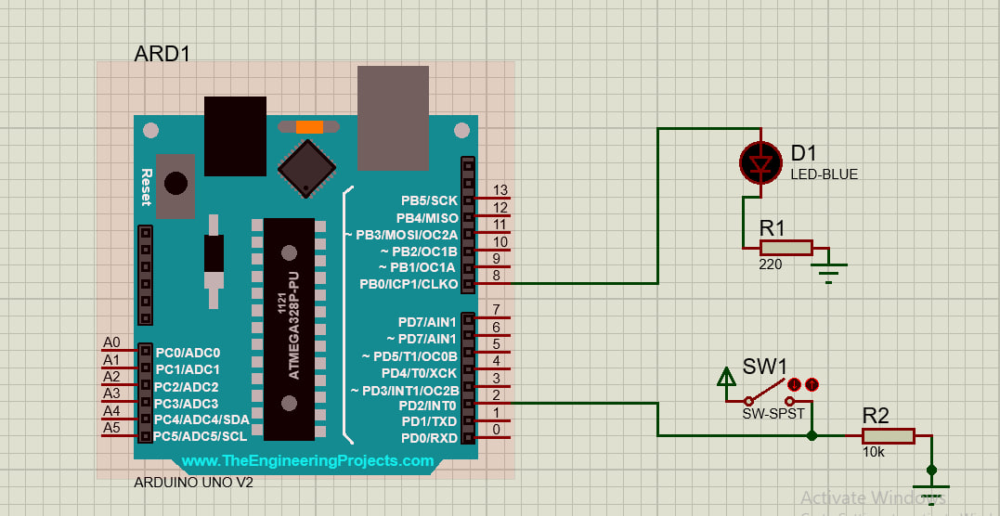
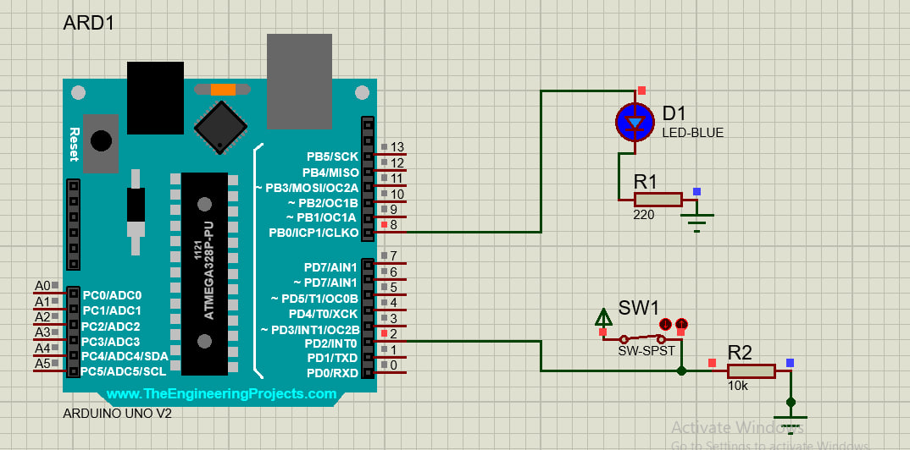

# 🔧 Arduino Starter Lab

> **Learn → Build → Experiment → Contribute**

A beginner-friendly open-source collection of **Arduino and embedded systems projects** designed to help beginners learn electronics, programming, sensors, and GitHub through hands-on projects.

Whether you're building your first Arduino circuit or making your first open-source contribution, you're welcome here.

---

## 📚 Learning Path

| Week     | Project                     | Main Concepts                         |
| -------- | --------------------------- | ------------------------------------- |
| 💡 **1** | Light-Activated LED         | LDR, analog input, thresholds         |
| 🔢 **2** | 7-Bit Random Number Display | Binary, LEDs, buttons                 |
| 💧 **3** | Water Leak Detector         | Sensors, digital input, state changes |
| 👏 **4** | Sound-Activated LED         | Sound sensors, timing                 |
| 📏 **5** | Ultrasonic Proximity Alarm  | Distance measurement, HC-SR04         |

### Project Previews

| Week   | Preview                                                             |
| ------ | ------------------------------------------------------------------- |
| Week 1 |                        |
| Week 2 |  |
| Week 3 |          |
| Week 4 |          |
| Week 5 | 📸 Coming soon                                                      |

---

## 🚀 Getting Started

### Requirements

* Arduino board
* Arduino IDE
* Basic electronic components
* Breadboard and jumper wires
* Proteus (optional, for simulation)

### Start Learning

Begin with **Week 1** and work through the projects in order.

For each project:

1. Read the project documentation.
2. Gather the required components.
3. Build the circuit.
4. Upload the Arduino code.
5. Test the project.
6. Experiment with the code.
7. Try the beginner challenge.

---

## 🤝 Contributing

You don't need to be an expert to contribute.

You can help by:

* 🐛 Reporting bugs
* 📖 Improving documentation
* 💡 Suggesting project ideas
* 🔧 Testing circuits
* 💻 Improving code
* 🌱 Creating beginner challenges
* 🚀 Adding new projects

Check **[CONTRIBUTING.md](CONTRIBUTING.md)** to learn how to contribute.

---

## 🗺️ Roadmap

* [x] Create beginner Arduino projects
* [x] Build a 5-week learning path
* [ ] Add detailed project documentation
* [ ] Add circuit diagrams
* [ ] Add beginner challenges
* [ ] Add contribution guidelines
* [ ] Add issue templates
* [ ] Add GitHub Actions
* [ ] Create beginner-friendly issues
* [ ] Expand into ESP32 and more advanced embedded systems

---

## ⭐ Support

If this project helps you learn:

**⭐ Star the repository**

**🐛 Report an issue**

**💡 Suggest an improvement**

**🤝 Contribute**

---

## 📄 License

This project is licensed under the **MIT License**.

See the [`LICENSE`](LICENSE) file for details.

---

### 🔧 Learn → Build → Experiment → Contribute
